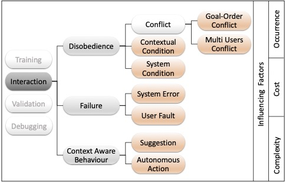

  

# Training

_Training_ covers the situations when users would like to know about some concepts, operations, and mechanics of the system or a component of the system mainly to learn how to operate with the system. Accordingly, the required explanation are generic and user-independent expositions of functions and components of a system (e.g., tool documentation for tech-savvy users or user manual for ordinary users).

# Interaction 
_Interaction_ motivation covers the situations where some intelligent behaviors of the system are not understandable, desirable, or expected by the user [[1]](#1). Hence, to steer the human-system interaction, the system should provide some explanations to clarify (e.g., the reason behind some actions or decisions), instruct (e.g., the required input or steps by users to proceed), and/or convince (e.g., that a decision or suggestion is valid, relevant and useful) the user [[2]](#2),[[3]](#3). Like the _Training_ motivation, the primary recipients of the _Interaction_ category's explanations are end-users engaging with the system. However, here the confusion is directly linked to the course of actions made by the user, the context of the use, and the system's state. Accordingly, the required explanation must be derived per case. Furthermore, since the lack of adjusted explanation leaves the user baffled or disinterested and hinders further interactions, the explanation must be built dynamically at runtime. 

    
<a href="Disobedience.md"> Disobedience</a>  

    
 - [Conflicts](Conflicts.md)
   - [Goal Order Conflict](Goal_Order_Conflict.md)
   - [Multi User Conflict](Multi_User_Conflict.md)

 - [Contextual Conditions](Contextual_Conditions.md)

 - [System Conditions](System_Conditions.md)
  

    
 <a href="Failure.md">Failure</a> 

  
  - [System Error](System_Error.md)
  
  - [User Fault](User_Fault.md)
  

    
 <a href="Context_Aware_Behaviour.md">Context Aware Behaviour</a> 

    
- [Suggestion](Suggestion.md)
  
- [Autonomous Actions](Autonomous_Actions.md)

# validation
_Validation_ that constitutes a large portion of research on explainability, particularly in the domain of artificial intelligence and machine learning (ML). ML-based applications are opaque systems generating models (trained over some pair of input and outputs) that can predict the outputs of unseen inputs. ML algorithms, however, do not allow obtaining the reason behind such correlation of input data to the associated label. It is often argued that there is a trade-off between the performance and transparency of a model [[4]](#5). 
The need for explanation stems from the desire and necessity of opening the model’s black box to interpret the model and validate its decisions. According to [[5]](#5), the explanations are required to detect any bias in the training dataset, to highlight adversarial perturbation that affects the prediction and to assure the existence of a truthful causality in the model reasoning. In contrast to the _Training_ category, here explanations are extremely case dependent and the target audience are domain experts and model developers. 
# Debugging
_Debugging_ which is also case-dependent, is a particular situation for particular types of systems. It occurs when a system developer wants to trace back an error or fix the system itself or a product of the system by applying some changes on firmware, mechanics, or structure of the system (e.g., code debugging in IDEs). Therefore in _Debugging_ cases, as well as the _Validation_, the application of the explanations is in the post-mortem analysis of an executed program -either successfully or not-, hence the derivation and building process of such explanations do not happen at runtime.

It is worth highlighting that we distinguish this situation with a state where a system behaves anomalously either due to mistakes of users (e.g., wrong inputs) or lack of necessary resources (e.g., internet, permissions). There is another similar but yet distinct circumstance where a system can report some malfunctioning to inform the users even though the user personally cannot take any action to fix the problem (e.g., when the touch screen of the system is not responsive). We have categorized the situations mentioned above under the _Interaction_ motivation because the trigger for the required explanation is an anomaly that damages the trust and obstructs the regular communication of the user with the system. The user needs an explanation to understand the situation and address the issue so s/he can continue to interact with the system at that particular moment rather than repairing (or building) a system.

##### References

 <a id="1">[1]</a>: Gregor, Shirley, and Izak Benbasat. "Explanations from intelligent systems: Theoretical foundations and implications for practice." MIS quarterly (1999): 497-530.

 <a id="2">[2]</a> : Dhaliwal, Jasbir S. "An experimental investigation of the use of explanations provided by knowledge-based systems." PhD diss., University of British Columbia, 1993

 <a id="3">[3]</a> : Hayes, Philip J., and D. Raj Reddy. "Steps toward graceful interaction in spoken and written man-machine communication." International Journal of Man-Machine Studies 19, no. 3 (1983): 231-284.s

 <a id="4">[4]</a> : Došilović, Filip Karlo, Mario Brčić, and Nikica Hlupić. "Explainable artificial intelligence: A survey." In 2018 41st International convention on information and communication technology, electronics and microelectronics (MIPRO), pp. 0210-0215. IEEE, 2018

 <a id="5">[5]</a> : Arrieta, Alejandro Barredo, Natalia Díaz-Rodríguez, Javier Del Ser, Adrien Bennetot, Siham Tabik, Alberto Barbado, Salvador García et al. "Explainable Artificial Intelligence (XAI): Concepts, taxonomies, opportunities and challenges toward responsible AI." Information Fusion 58 (2020): 82-115